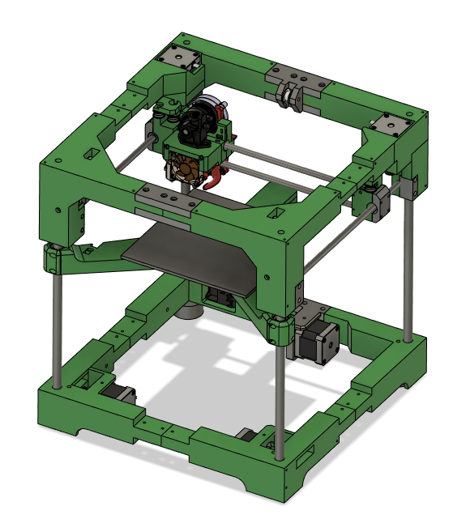

# Rook 180
Welcome to the DIY 3D Printer called Rook 180!

This is a 180x180 build volume printer based on the original Rook

### PLEASE NOTE THIS PRINTER IS A WORK IN PROGRESS!

The goal of this printer is to make a cheap easy to build 3D printer than can be built by anyone.

## Features:

- 180 x 180 Build Volume
- 3D Printed Frame
- CoreXY
- Triple Belted Z
- Only Roughly $400 USD in cost

## Build F.A.Q

- I print with 3 walls and 15 percent infill, if you want stronger go 4 walls 20 percent infill should be plenty
- I use PLA for the prototype and it worked well, ABS and ASA would be great too
- This printer uses all F695 bearings with some 20t idlers for the belted Z

### [BOM on Google Drive](https://docs.google.com/spreadsheets/d/1l0jujA7NeqoZIqLFWoQa9GS_q04f8Wfkya9Il5d2ubA/edit#gid=0)

### [Support me on Patreon](https://www.patreon.com/rolohaun)

### [My Discord](https://discord.gg/jJSwTtkX6T)
